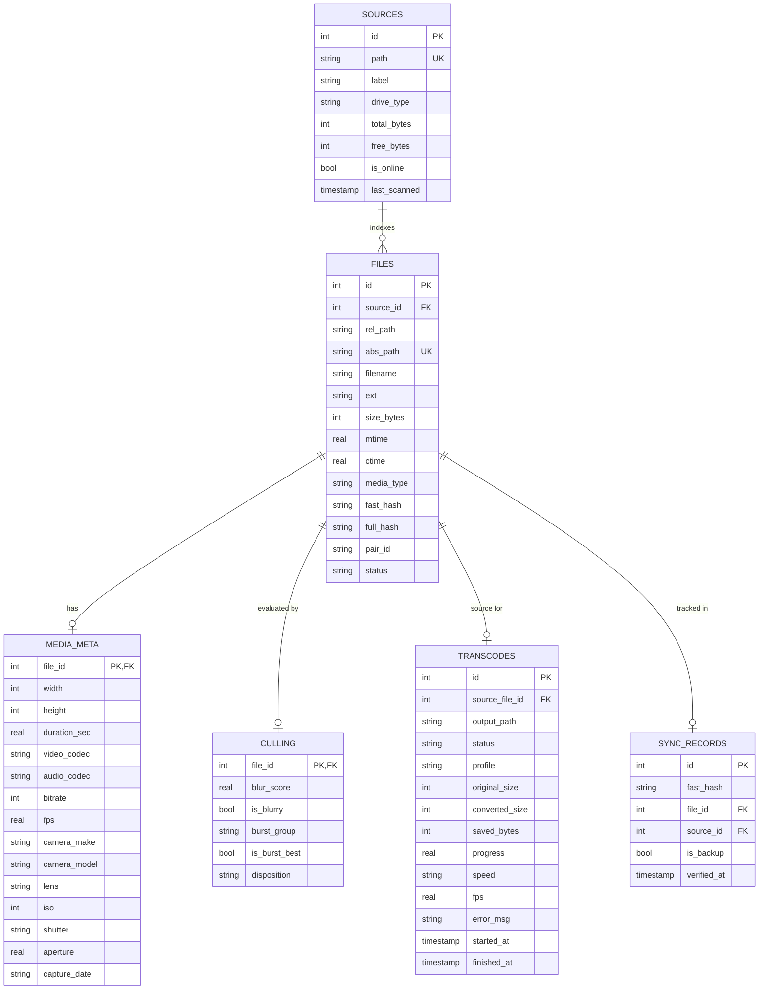

# SaveSpace: Technical Architecture & Living Design Specification

> **Document Status**: Active / Authoritative Reference  
> **Target Audience**: Developers, AI Engineering Assistants, Systems Architects  
> **Last Updated**: September 2026  
> **Repository**: [https://github.com/verycosmicstuff/savespace.git](https://github.com/verycosmicstuff/savespace.git)

---

## 1. Executive Overview & Mission

SaveSpace is an enterprise-grade, local-first desktop application designed specifically for photographers, videographers, and digital archivists who handle massive media libraries across working SSDs, internal hard drives, and network-attached storage (NAS). 

High-resolution mirrorless camera systems (e.g., Fujifilm 40MP X-Trans, Sony A7R series) and 4K/60 raw video create extreme storage bottlenecks. SaveSpace solves this through:
1. **Unified Multi-Source Cataloging**: Rapidly indexes dispersed storage without duplicating media.
2. **Hardware-Accelerated Transcoding**: Harnesses NVIDIA NVENC (RTX 3060) to achieve visually lossless 10-bit H.265 compression with zero UI lag.
3. **Intelligent Bitrate Analysis & Zero-Bloat Guarantee**: Algorithmically detects pre-compressed media to prevent file size inflation, enforcing a strict engine-level check that discards bloated re-encodes.
4. **Computer Vision Culling**: Leverages OpenCV Laplacian variance to score image sharpness and detect blurry frames.
5. **Exact Duplicate Elimination with Sidecar Protection**: Detects byte-for-byte duplicates while shielding metadata sidecar files (`.xmp`) from accidental deletion.
6. **Operating System Integration**: Deep native Windows File Explorer integration for 1-click reveals, location tracking, and safe Recycle Bin trashing.

```mermaid
graph TD
    UI["Frontend Interface<br/>(HTML5 / Vanilla ES6 / Glassmorphism CSS)"]
    GUI_SHELL["Desktop Shell<br/>(PyWebView / Microsoft WebView2)"]
    FASTAPI["FastAPI REST Server<br/>(127.0.0.1:8765 / Uvicorn)"]
    
    subgraph Core Subsystems
        INDEXER["Multi-Drive Indexer & Sidecar Linker<br/>(Fast xxHash / ExifRead / FFprobe)"]
        DEDUPER["Duplicate Detector<br/>(Two-Tier Hashing & Name Filter)"]
        CULLER["OpenCV Blur & Burst Analyzer<br/>(Laplacian Variance Engine)"]
        ADVISOR["Intelligent Video Advisor<br/>(Bitrate / Resolution / Codec Analyzer)"]
        TRANSCODER["NVENC Video Transcoder<br/>(RTX 3060 / Zero-Bloat Guard / os.utime)"]
        SYNC["SSD-to-NAS Sync Tracker<br/>(Safe Space Reclamation)"]
    end
    
    DB[(SQLite Catalog<br/>WAL Mode / Thread-Safe Locks)]
    FS[("File Systems<br/>(Working SSD / Internal HDD / NAS Archives)")]

    UI <-->|HTTP REST & JSON| FASTAPI
    GUI_SHELL --- UI
    FASTAPI --> Core Subsystems
    Core Subsystems <--> DB
    Core Subsystems <--> FS
```

---

## 2. Technology Stack & Runtime Environment

| Layer | Technology | Version / Specification | Rationale |
| :--- | :--- | :--- | :--- |
| **Runtime** | Python | 3.11 64-bit | Optimal performance, async FastAPI compatibility, broad C-extension support. |
| **Desktop Shell** | PyWebView | WebView2 Evergreen | Zero-overhead native desktop experience without heavy Electron bloat. |
| **API Server** | FastAPI + Uvicorn | Embedded local-loop | High-throughput asynchronous endpoints, automatic Pydantic data validation. |
| **Database** | SQLite 3 | WAL Mode | Atomic, zero-config single file catalog with high concurrent read capability. |
| **Computer Vision** | OpenCV (`cv2`) | 4.x Headless | High-speed C++ Laplacian variance matrix calculations for blur detection. |
| **Raw Media** | RawPy / ExifRead / Pillow | Latest | Camera RAW decoding (Fuji RAF, Sony ARW, Canon CR3) and EXIF extraction. |
| **Video Engine** | FFmpeg & FFprobe | Hardware NVENC build | RTX 3060 NVENC GPU acceleration (`hevc_nvenc`), P010 10-bit color. |
| **Hashing** | xxHash (`xxhash`) + SHA-256 | Fast sample + Full sha256 | Microsecond-level pre-filtering of gigabyte files before full verification. |
| **Frontend** | Vanilla ES6 / Modern CSS | Zero build tool dependencies | Instant load time, 100% maintainable, zero node/npm vulnerability footprint. |

---

## 3. Database Architecture & Data Dictionary

SaveSpace uses a centralized SQLite database stored in `data/savespace.db`. The database operates strictly under **WAL (Write-Ahead Logging)** mode with a re-entrant write lock (`threading.RLock`) in Python, guaranteeing thread safety across concurrent background tasks.

### 3.1 SQLite Pragmas
```sql
PRAGMA journal_mode = WAL;
PRAGMA synchronous = NORMAL;
PRAGMA busy_timeout = 60000;
PRAGMA foreign_keys = ON;
```

### 3.2 Entity-Relationship Diagram



### 3.3 Hashing Strategy
- **`fast_hash`**: Computed by sampling 64 KB from the file head, middle, and tail combined with file size via `xxhash.xxh64`. Runs in $< 1\text{ ms}$ even on 100 GB video files.
- **`full_hash`**: Standard 256-bit SHA-256 computed on demand only when a `fast_hash` collision occurs, guaranteeing zero false-positive duplicate groupings.

---

## 4. Subsystems Deep Dive

### 4.1 Indexer & Sidecar Coupling (`src/scanner/`)

- **File System Crawler**: Traverses mounted drives recursively. Skips system folders (`$RECYCLE.BIN`, `System Volume Information`, `.git`).
- **Media Classification**:
  - `RAW_EXTS`: `.raf`, `.dng`, `.cr2`, `.cr3`, `.arw`, `.nef`, `.rw2`, `.orf`
  - `PHOTO_EXTS`: `.jpg`, `.jpeg`, `.png`, `.webp`, `.tiff`, `.tif`, `.heic`
  - `VIDEO_EXTS`: `.mov`, `.mp4`, `.mkv`, `.avi`, `.m4v`, `.webm`, `.prores`
  - `SIDECAR_EXTS`: `.xmp`
- **Pair ID Calculation**:
  ```python
  def compute_pair_id(parent_path: Path, base_stem: str) -> str:
      return hashlib.md5(f"{str(parent_path).lower()}::{base_stem.lower()}".encode()).hexdigest()
  ```
  This locks RAW files, JPEGs, and XMP sidecars that share a base stem (e.g. `DSCF0001.RAF` + `DSCF0001.xmp`) into an inseparable atomic unit.

---

### 4.2 Computer Vision Culling Engine (`src/analyzer/culler.py`)

- **Blur Detection Algorithm**: Evaluates the variance of the discrete Laplacian operator on grayscale downsampled images:
  $$\text{Blur Score} = \sigma^2 = \text{Var}\left(\nabla^2 I\right)$$
  - High variance $\implies$ Sharp edges, distinct transitions.
  - Low variance $\implies$ Blurry, motion blur, out of focus.
  - Normalized mapping: Scores are scaled logarithmically into a human-readable 0–100 index (threshold $\le 20$ marks image as blurry).
- **Burst Grouping**: Groups photos taken within 3 seconds of each other with identical camera parameters (`camera_model`, `iso`, `shutter`). The photo with the highest blur score in the cluster is automatically flagged as `is_burst_best = 1`.
- **Sidecar-Coupled Trashing**: Any action performed on a photo (move to trash, quarantine) automatically locates and moves its `.xmp` sidecar.

---

### 4.3 Duplicate Media Detection (`src/analyzer/deduper.py`)

- **Strict Media Filter**:
  ```sql
  WHERE status = 'active'
    AND media_type IN ('photo', 'raw', 'video')
    AND ext NOT IN ('.xmp', '.thm', '.lrf', '.xml', '.json', '.txt')
    AND size_bytes >= 10240
  ```
- **Sidecar Protection Rationale**: Standard camera/Lightroom exports generate default 446-byte XML sidecar templates with identical content. Without explicit exclusion, thousands of distinct photo sidecars match hashes and are falsely marked as redundant. SaveSpace strictly isolates sidecars from standalone deduplication.
- **Filename Integrity Safeguards**:
  - `same_name_only = True` (Default): Clustered duplicates must share the exact same filename across directories or drives (e.g. `DSCF0963.RAF` on SSD vs Backup).
  - Non-matching filenames are tagged `DIFFERENT FILENAME` in amber and **never auto-checked** for deletion.

---

### 4.4 Hardware-Accelerated Video Transcoder (`src/transcoder/engine.py`)

- **Hardware Target**: NVIDIA GeForce RTX 3060 (NVENC Gen 7).
- **FFmpeg Execution Pipeline**:
  ```powershell
  ffmpeg -y -hide_banner -v error -stats \
    -hwaccel cuda \
    -i "<source_path>" \
    -vcodec hevc_nvenc \
    -preset p6 \
    -tune hq \
    -rc vbr \
    -cq 22 \
    -pix_fmt p010le \
    -acodec copy \
    -map_metadata 0 \
    "<output_path>"
  ```
- **Windows Priority Throttling**: The transcoding subprocess is spawned using Windows process creation flags:
  ```python
  creationflags = subprocess.BELOW_NORMAL_PRIORITY_CLASS  # 0x00004000
  ```
  This ensures that full GPU hardware acceleration is utilized without causing frame drops or UI latency in active foreground applications.
- **Timestamp & Metadata Preservation**: Upon transcode completion, the original source file's `mtime` (modification timestamp) is stamped onto the transcoded output using `os.utime(output_path, (orig_mtime, orig_mtime))`.

---

### 4.5 Intelligent Video Advisor & Zero-Bloat Guarantee (`src/analyzer/video_advisor.py`)

Re-encoding low-bitrate videos (e.g. 2.5 Mbps OBS screen captures) with CQ 22 causes the encoder to allocate higher bitrates to reproduce screen noise, resulting in file bloat (2×–3× larger).

#### Target Bitrate & Bloat Threshold Table:
| Resolution Category | Target Bitrate (H.265 CQ 22) | Bloat Threshold ($\le$) | High Savings Threshold ($\ge$) |
| :--- | :--- | :--- | :--- |
| **4K / UHD** ($\ge 3840\times 1800$) | **18 Mbps** | 14 Mbps | 40 Mbps |
| **1440p / 2K** ($\ge 2560\times 1200$) | **10 Mbps** | 8 Mbps | 22 Mbps |
| **1080p / FHD** ($\ge 1600\times 900$) | **5 Mbps** | 3.8 Mbps | 12 Mbps |
| **720p / HD** ($\ge 1000\times 600$) | **2.5 Mbps** | 2.0 Mbps | 6 Mbps |
| **SD / Low Res** ($< 720p$) | **1.2 Mbps** | 0.95 Mbps | 3 Mbps |

#### Classification Logic:
1. **Uncompressed / ProRes / RAW**: Always `high_savings` (~80% space reclaimed).
2. **Already HEVC / AV1 / VP9**:
   - If camera intra-frame ($\ge 80\text{ Mbps}$): `high_savings` (camera master to delivery).
   - If standard distribution: `already_hevc` (0 B savings, re-encoding skipped).
3. **Bitrate $\le$ Bloat Threshold**: `already_compact` (0 B savings, flagged as Bloat Risk).
4. **Moderate Bitrate**: `moderate_savings` (20%–50% savings).
5. **High Bitrate**: `high_savings` (50%–85% savings).

#### Zero-Bloat Engine Safeguard:
In `src/transcoder/engine.py`:
```python
conv_size = self.output_path.stat().st_size

# If transcoded file is larger than original or saves less than 3%:
if conv_size >= orig_size or (orig_size - conv_size) < (orig_size * 0.03):
    self._cleanup_failed() # Immediately unlinks/deletes output_path
    self._update_db_skipped_bloat(
        orig_size, conv_size,
        "Original was already more compact than H.265 output. Bloat prevented; kept original."
    )
    return True # Job finishes gracefully without corrupting disk space
```

---

## 5. Desktop UI & Frontend Architecture

The user interface is contained entirely within `ui/` and is served locally by the embedded FastAPI instance. It requires no build steps, bundlers, or package managers.

### 5.1 Structure
- `ui/index.html`: Semantic layout with 6 tab panels (`tab-overview`, `tab-culler`, `tab-duplicates`, `tab-transcoder`, `tab-sync`, `tab-organizer`).
- `ui/css/app.css`: Dark glassmorphism theme (`#0b0f19` background, `#06b6d4` cyan accents, `#10b981` emerald accents, `#f43f5e` rose accents).
- `ui/js/app.js`: Single-page controller managing polling, DOM updates, multi-select sets, and custom context menus.

### 5.2 Custom Context Menu & Windows Explorer Integration
Right-clicking any card or table row launches `#custom-context-menu`:
- **Open in File Explorer**: Dispatches `POST /api/files/open-location` with `{ path, select: true }`. The backend invokes:
  ```powershell
  explorer.exe /select,"<absolute_path>"
  ```
  This opens the exact folder in Windows Explorer and highlights the file.
- **Open Containing Folder**: Opens the parent folder without selecting.
- **Copy Full File Path / Copy Folder Path**: Writes sanitized Windows path to the system clipboard via `navigator.clipboard.writeText`.

### 5.3 High-Performance Thumbnail Pipeline & 60 FPS Scrolling
Photo galleries with high-resolution mirrorless RAW files (Fuji 40MP, Sony 61MP) face severe UI stutter if thumbnails are unoptimized:
1. **Pillow Downscaling at Extraction**: Embedded RAW JPEG previews (which can be 4416×2944 and 4MB–6MB each) are dynamically downscaled to max 380px (~12 KB) using `Image.Resampling.BILINEAR` with `quality=80, optimize=True`. This dropped thumbnail storage from 12.6 GB to ~400 MB (99.7% memory saving).
2. **Zero-SQL Disk Serving**: `GET /api/thumbnail/{file_id}` verifies disk presence via `Path.is_file()` and streams cached JPEGs immediately without locking the SQLite database.
3. **HTTP Cache Immutability**: All thumbnail responses send `Cache-Control: public, max-age=31536000, immutable`, enabling the Chromium/WebView2 renderer to cache images permanently in memory and disk.
4. **Browser Compositing & CSS Containment**:
   - `content-visibility: auto; contain-intrinsic-size: 200px 220px;`: Skips offscreen layout and paint until cards approach the viewport.
   - `decoding="async"`: Decompresses image bitmaps on background worker threads without blocking main thread scrolling.
   - Eliminates expensive GPU `backdrop-filter: blur()` from grid badges to prevent compositor frame drops.
   - Progressive batch loading (80 cards per chunk) prevents initial DOM bloat while browsing large catalogs.

---

## 6. REST API Endpoint Reference

### 6.1 Sources & Scanner
- `GET /api/sources`: Returns all configured drive roots, drive types, total/free bytes, excluded subfolder arrays, and scan timestamps.
- `POST /api/sources`: Registers a new folder or drive root. Body: `{ "path": str, "label": str, "drive_type": str, "excluded_paths": Optional[List[str]] }`.
- `GET /api/sources/{id}/subfolders`: Lists immediate subdirectories in the drive root, indicating whether each folder is currently included or deselected/excluded.
- `POST /api/sources/{id}/exclusions`: Persists deselected subfolder exclusions. Body: `{ "excluded_paths": List[str], "purge_indexed": bool }`. When `purge_indexed` is true, automatically deletes indexed records for files under those folders.
- `POST /api/utils/list_subfolders`: Dynamically inspects subdirectories for an unverified path before source registration.
- `POST /api/sources/{id}/scan`: Triggers background crawl with in-place `os.walk` directory pruning, fast xxHash sampling, and EXIF/video probe extraction.

### 6.2 Culler & Blur Quality
- `GET /api/culling/blurry`: Returns photos with `blur_score <= max_score` and `is_blurry = 1`.
- `GET /api/culling/bursts`: Returns grouped burst clusters.
- `POST /api/culling/action`: Executes action on file IDs. Body: `{ "file_ids": List[int], "action": "trash" | "quarantine" | "keep", "include_sidecars": bool }`.

### 6.3 Duplicates
- `GET /api/duplicates`:
  - Query parameters: `source_id: Optional[int]`, `cross_source_only: bool = False`, `same_name_only: bool = True`.
  - Returns duplicate clusters with verified matching SHA-256 hashes.
- `POST /api/duplicates/resolve`: Recycles selected duplicate file IDs to Windows Recycle Bin with atomic sidecar handling.

### 6.4 Transcoding
- `GET /api/transcodes/candidates`:
  - Query parameters: `source_id`, `min_size_mb`, `codec`, `search`, `suitability` (`recommended` | `high_savings` | `already_compact` | `already_hevc`).
  - Returns videos enriched with folder location, formatted bitrate, and compression suitability.
- `GET /api/transcodes/queue`: Returns master queue progress, active job metrics (FPS, speed multiplier, elapsed time), and breakdown table.
- `POST /api/transcodes/queue`: Enqueues files for transcoding. Body: `{ "file_ids": List[int], "profile": str, "dest_dir": Optional[str] }`.
- `POST /api/transcodes/control`: Controls the queue runner. Query parameter: `action=start|pause|resume|cancel`.

### 6.5 System & Explorer Utilities
- `POST /api/files/open-location`: Opens Windows Explorer. Body: `{ "path": str, "select": bool }`.
- `POST /api/utils/pick_folder`: Spawns native Windows folder selection dialog via Win32 Tkinter bridge.

---

## 7. Developer & Maintenance Guidelines

### 7.1 Running Tests
All backend tests are executed using Python 3.11:
```powershell
& "C:\Users\Sunny\AppData\Local\Programs\Python\Python311\python.exe" -m unittest discover tests
```

### 7.2 Adding New Transcoding Profiles
To register a new encoding profile, add it to `TRANSCODE_PROFILES` in `src/transcoder/engine.py`:
```python
TRANSCODE_PROFILES["my_new_profile"] = {
    "name": "Custom Profile Name",
    "ext": ".mp4",
    "vcodec": "hevc_nvenc",
    "extra_vflags": ["-preset", "p7", "-cq", "20"],
    "acodec": "aac",
    "extra_aflags": ["-b:a", "256k"],
}
```

### 7.3 Preserving Living Documentation
Whenever introducing database schema changes, new media format extensions, or transcoding algorithm updates:
1. Update `TECH_DOCUMENTATION.md` immediately with the updated schema or formulas.
2. Keep `PROJECT_MAP.md` under 300 words as a fast context bridge for AI coding assistants.
3. Commit and push updates to the main branch on GitHub.
